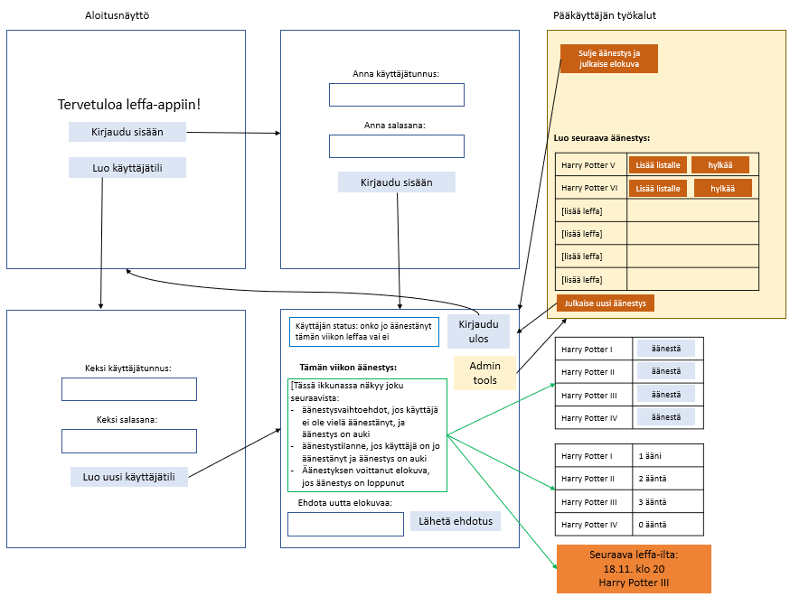

# Vaatimusmäärittely

## Sovelluksen tarkoitus

Tällä sovelluksella voi ehdottaa elokuvaa ja äänestää valitusta listasta elokuvaa viikoittaista leffailtaa varten. Sovelluksen perimmäinen tarkoitus on tarjota demokraattinen ja matalavolyyminen tapa sopia siitä, mitä elokuvaa katsotaan.

## Käyttäjät

Sovelluksella on kahdenlaisia käyttäjiä: peruskäyttäjä ja pääkäyttäjä (admin). Peruskäyttäjäroolilla voi äänestää elokuvaa ja ehdttaa uutta elokuvaa seuraavaan äänestykseen, ja pääkäytäjärooli on puhtaasti hallinnollinen. Pääkäyttäjärooli ei siis tarjoa mahdollisuutta äänestystoimintoon. Tarkoituksena on pitää roolit erillään ja pääkäyttäjällä tulee olla erikseen myös käyttäjäroolin tunnukset, jos hän haluaa osallistua elokuvien äänestämiseen.

## Käyttöliittymäluonnos

Kuvasta poiketen sovellus toimii tekstikäyttäliittymällä, ei graafisella. Kuva kuitenkin havainnollistaa sovelluksen ominaisuuksia.

Sovelluksen käynnistyessä käyttäjällä on neljä vaihtoehtoa:

- Create new user account 
- Log in as returning user 
- Log in as the admin user 
- Close app
  

Käyttäjä valitsee sopivan vaihtoehdon antamalla sitä vastaavan kirjaimen []. Sovellus hyväksyy sekä ison että pienen kirjaimen. Sekä uusi käyttäjä
että jo aiemmin tilin luonut käyttäjä pääsevät tunnus-salasana -vaiheen jälkeen äänestämään elokuvaa. 

Admin-kirjautuminen antaa tarjolle admin-työkalut:
- Print current voting list 
- Clear voting list 
- Set up a new votings list 
- Exit admin tools 

## Ennen kirjautumista

Sovelluksen käynnistyessä käyttäjällä on meljä vaihtoehtoa:
- Create new user account (luo uusi käyttäjä)
- Log in as returning user (kirjaudu sisään vanhana käyttäjänä)
- Log in as the admin user (kirjaudu sisään pääkäyttäjänä)
- Close app (sulje sovellus)

- Käyttäjä voi luoda järjestelmään käyttäjätilin (käyttäjätunnuksen täytyy olla uniikki ja vähintään 3 merkkiä pitkä - TEHTY
- Järjestelmään kirjaudutaan tunnuksella ja salanalla. Jos tunnusta ei ole olemassa tai salasana on väärin, siitä tulee virheilmoitus. - TEHTY
- Admin-käyttäjälle on määritelty omat työkalut - TEHTY

## Kirjautumisen jälkeen

Käyttäjä:
  - Käyttäjällä on mahdollisuus äänestää elokuvaa - TEHTY
  - Käyttäjä voi ehdottaa uuttaa elokuvaa ensi viikon äänestykseen - TEHTY
  - Käyttäjä voi kirjautua ulos järjestelmästä - TEHTY

Admin:
  - Voi tyhjentää elokuvalistan - TEHTY
  - Voi asettaa uuden äänestyslistan - TEHTY
  - Voi julkaista äänestyksen voittaneen elokuvan
  - voi hyväksyä käyttäjän elokuvaehdotuksen osaksi seuraavaa äänestyslistaa - TEHTY

## Jatkokehitysideoita

Perusversion jälkeen sovellukseen voisi lisätä mm. seuraavat ominaisuudet
- Mahdollisuus katsoa äänestystilanne ilman kirjautumista (ns. vieraskäyttäjä-status, apin käyttö ilman käyttäjätiliä)
- Käyttäjä: vaihtaa mielipidettä eli perua aiemman äänestyksen ja äänestää uudelleen
- Käyttäjä: mahdolisuus katsoa äänestystilanne (kuinka monta ääntä kukin leffa on saanut)
- Chat, jossa voi keskustella leffavalinnoista, ja pääkäyttäjälle editointioikeudet siihen
- Tilasto aiemmista äänestyksistä
- Mahdollisuus poistaa käyttäjätunnus (joko itse tai sitten pääkäyttäjä heittää käyttäjän ulos)
- Äänestystilanteen laskemismetodin jatkojalostus niin, että se tunnistaa tasapelitilanteet

